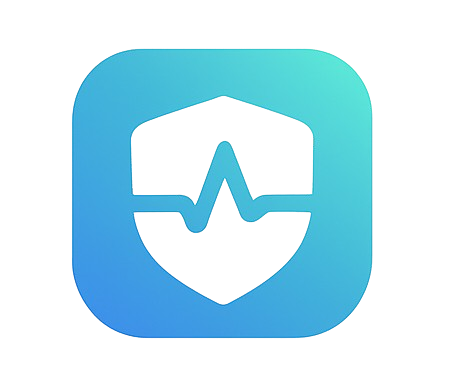

<div align="center">
  
  
  # MedSense
  
  ### Your Personal Medication Adherence Companion
  
  [](https://web.dev/progressive-web-apps/)
  [](https://react.dev/)
  [](https://firebase.google.com/)
  [](LICENSE)
  
  MedSense is a modern, Progressive Web Application designed to bridge the gap between patients and their caregivers. It ensures patients stay on track with their medication schedules while providing caregivers with real-time insights and peace of mind.
  
  [Features](#-features) • [Getting Started](#-getting-started) • [Documentation](#-documentation) • [Tech Stack](#️-tech-stack) • [Contributing](#-contributing)
  
</div>

---

## 📋 Table of Contents

- [Features](#-features)
- [Getting Started](#-getting-started)
  - [Prerequisites](#prerequisites)
  - [Installation](#installation)
  - [Firebase Configuration](#firebase-configuration)
  - [Running the App](#running-the-app)
- [PWA Setup](#-pwa-setup)
- [Project Structure](#-project-structure)
- [Tech Stack](#️-tech-stack)
- [Documentation](#-documentation)
- [Contributing](#-contributing)
- [License](#-license)

---

## ✨ Features

### For Patients 🏥

- **📱 Smart Reminders**: Dual notification system (5 minutes before + on-time alerts)
- **💊 Medication Tracking**: Easily manage medications with dosage and frequency details
- **📊 Adherence Monitoring**: Visual charts and scores to track medication compliance
- **✅ One-Tap Logging**: Mark medications as taken with a single click
- **🔒 Secure Access**: Firebase-powered authentication
- **🌐 Offline Support**: Access your schedule and log doses without internet connectivity
- **👥 Caregiver Connection**: Invite family members or healthcare providers to monitor your progress

### For Caregivers 👨‍⚕️

- **📋 Patient Dashboard**: View all connected patients in one place
- **📈 Real-time Monitoring**: Track adherence scores, recent logs, and missed dose alerts
- **🔔 Invitation System**: Securely connect with patients via email invitations
- **📱 Mobile Optimized**: Dedicated mobile navigation for quick access
- **🔍 Search & Filter**: Easily find and manage patients
- **📊 Detailed Reports**: View medication lists, activity logs, and status updates

### Technical Highlights ⚡

- **🚀 Progressive Web App (PWA)**: Install on any device for native-like experience
- **📴 Offline-First**: Full functionality without internet connection
- **🔄 Real-time Sync**: Instant data synchronization when back online
- **🎨 Modern UI**: Beautiful, responsive design with Tailwind CSS
- **🔐 Secure**: Firebase Authentication and Firestore security rules

---

## 🚀 Getting Started

### Prerequisites

Before you begin, ensure you have the following installed:

- **Node.js** (v14.0.0 or higher)
- **npm** (v6.0.0 or higher) or **yarn**
- **Git**
- A **Firebase** account

### Installation

1. **Clone the repository**
   ```bash
   git clone https://github.com/Osaseye/Medsense.git
   cd Medsense
   ```

2. **Install dependencies**
   ```bash
   npm install
   ```

### Firebase Configuration

1. **Create a Firebase Project**
   - Go to the [Firebase Console](https://console.firebase.google.com/)
   - Click "Add Project" and follow the setup wizard
   - Enable **Authentication** (Email/Password method)
   - Enable **Firestore Database** (Start in production mode)

2. **Get your Firebase configuration**
   - In your Firebase project, go to Project Settings
   - Scroll down to "Your apps" and click the web icon `</>`
   - Register your app and copy the configuration object

3. **Update Firebase credentials**
   - Create or update `src/firebase.js` with your configuration:
   ```javascript
   import { initializeApp } from 'firebase/app';
   import { getAuth } from 'firebase/auth';
   import { getFirestore, enableIndexedDbPersistence } from 'firebase/firestore';

   const firebaseConfig = {
     apiKey: "YOUR_API_KEY",
     authDomain: "YOUR_AUTH_DOMAIN",
     projectId: "YOUR_PROJECT_ID",
     storageBucket: "YOUR_STORAGE_BUCKET",
     messagingSenderId: "YOUR_MESSAGING_SENDER_ID",
     appId: "YOUR_APP_ID"
   };

   const app = initializeApp(firebaseConfig);
   export const auth = getAuth(app);
   export const db = getFirestore(app);

   // Enable offline persistence
   enableIndexedDbPersistence(db).catch((err) => {
     if (err.code === 'failed-precondition') {
       console.warn('Multiple tabs open, persistence can only be enabled in one tab at a time.');
     } else if (err.code === 'unimplemented') {
       console.warn('The current browser does not support persistence.');
     }
   });
   ```

### Running the App

1. **Development mode**
   ```bash
   npm run dev
   ```
   Open [http://localhost:5173](http://localhost:5173) in your browser

2. **Build for production**
   ```bash
   npm run build
   ```

3. **Preview production build**
   ```bash
   npm run preview
   ```

---

## 📱 PWA Setup

MedSense is PWA-ready out of the box! Here's what you need to know:

### What's Included

- ✅ Service Worker registration (automatic)
- ✅ Offline caching strategy
- ✅ Web App Manifest
- ✅ Installable on all platforms

### Adding PWA Icons

For the best PWA experience, add these icon files to the `public` folder:

- `pwa-192x192.png` - 192x192 pixels
- `pwa-512x512.png` - 512x512 pixels
- `favicon.ico` - 32x32 pixels
- `apple-touch-icon.png` - 180x180 pixels (optional)

### Installing the App

**Desktop:**
1. Open the app in Chrome, Edge, or supported browser
2. Look for the install icon in the address bar
3. Click "Install"

**Mobile:**
1. Open the app in Chrome (Android) or Safari (iOS)
2. Tap the menu (⋮ or Share icon)
3. Select "Add to Home Screen" or "Install App"

### Offline Support

The app works offline thanks to:
- **Firestore Offline Persistence**: Data cached locally
- **Service Worker**: Static assets cached for offline access
- **Auto-sync**: Changes sync automatically when connection is restored

---

## 📁 Project Structure

```
Medsense/
├── public/
│   └── logo.png              # App logo
├── src/
│   ├── assets/               # Static assets
│   ├── components/           # Reusable components
│   │   ├── Modal.jsx
│   │   └── ...
│   ├── context/              # React Context providers
│   │   ├── AuthContext.jsx
│   │   ├── MedicationContext.jsx
│   │   ├── ReminderContext.jsx
│   │   └── NotificationContext.jsx
│   ├── layouts/              # Layout components
│   │   └── MainLayout.jsx
│   ├── pages/                # Page components
│   │   ├── Dashboard.jsx
│   │   ├── Medications.jsx
│   │   ├── Reminders.jsx
│   │   ├── Adherence.jsx
│   │   ├── Patients.jsx
│   │   ├── Caregiver.jsx
│   │   ├── Settings.jsx
│   │   └── ...
│   ├── App.jsx               # Main app component
│   ├── main.jsx              # Entry point
│   ├── firebase.js           # Firebase configuration
│   └── index.css             # Global styles
├── documentation.md          # Detailed documentation
├── package.json
├── vite.config.js            # Vite + PWA configuration
├── tailwind.config.js        # Tailwind CSS configuration
└── README.md
```

---

## 🛠️ Tech Stack

### Frontend
- **React 19.2.0** - UI library
- **Vite 7.2.4** - Build tool and dev server
- **React Router Dom 7.9.6** - Client-side routing
- **Tailwind CSS 3.4.18** - Utility-first CSS framework
- **React Icons 5.5.0** - Icon library

### Backend & Services
- **Firebase 12.6.0**
  - Authentication - User management
  - Firestore - NoSQL database with offline support
  - Hosting (optional) - Deploy your app

### PWA
- **vite-plugin-pwa 1.2.0** - PWA plugin for Vite
- **Workbox** (via plugin) - Service worker strategies

### Development Tools
- **ESLint** - Code linting
- **PostCSS** - CSS processing
- **Autoprefixer** - CSS vendor prefixing

---

## 📚 Documentation

For comprehensive documentation including:
- Architecture details
- User guides (Patient & Caregiver)
- API references
- Troubleshooting

Please refer to [documentation.md](documentation.md)

---

## 🤝 Contributing

We welcome contributions! Here's how you can help:

1. **Fork the repository**
2. **Create a feature branch**
   ```bash
   git checkout -b feature/AmazingFeature
   ```
3. **Commit your changes**
   ```bash
   git commit -m 'Add some AmazingFeature'
   ```
4. **Push to the branch**
   ```bash
   git push origin feature/AmazingFeature
   ```
5. **Open a Pull Request**

### Development Guidelines
- Follow the existing code style
- Write meaningful commit messages
- Test your changes thoroughly
- Update documentation as needed

---

## 📄 License

This project is licensed under the MIT License - see the [LICENSE](LICENSE) file for details.

---

## 📞 Support

If you encounter any issues or have questions:

- 📧 Email: support@medsense.com
- 🐛 Issues: [GitHub Issues](https://github.com/Osaseye/Medsense/issues)
- 📖 Docs: [documentation.md](documentation.md)

---

## 🙏 Acknowledgments

- Built with ❤️ for better healthcare adherence
- Firebase for backend infrastructure
- React community for amazing tools and libraries


---

<div align="center">
  
  **Made with ❤️ by the MedSense Team**
  
  ⭐ Star us on GitHub if you find this project useful!
  
</div>

